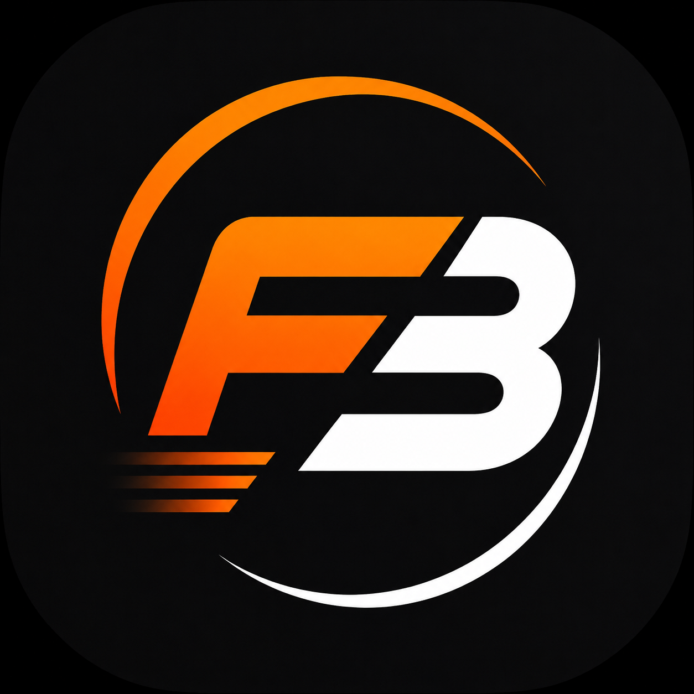
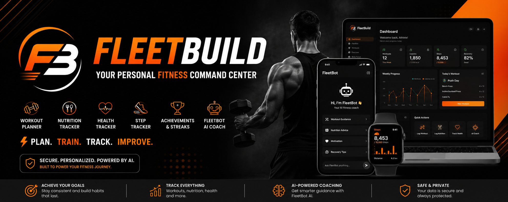

<div align="center">

# ⚡FleetBuild⚡
**Your Personal Fitness Command Center**

<div align="center">





</div>

A modern, full-stack fitness application designed to bring **workouts, nutrition, health tracking, progress, achievements, and AI-powered coaching** into one focused experience.

[](https://fleetbuild.onrender.com/)
[](https://github.com/Satvik-Creations/FleetBuild)
[](https://react.dev/)
[](https://www.typescriptlang.org/)
[](https://nodejs.org/)

<br />

**🌐 Live Application:** https://fleetbuild.onrender.com/

</div>

---

## 📖 About FleetBuild

FleetBuild is a **full-stack personal fitness platform** built to make structured fitness management simpler, smarter, and more engaging.

Instead of treating fitness as a collection of disconnected tools, FleetBuild brings the complete journey together:

**Plan → Train → Track → Recover → Improve**

The application combines a responsive React interface with an Express/TypeScript backend, persistent user data, authentication, AI-powered features, workout planning, nutrition tracking, progress monitoring, achievements, and payment-enabled premium access for FleetBot.

---

## ✨ Highlights

### 🏠 Personalized Dashboard

A central overview of your fitness journey, including important daily metrics, progress indicators, workout information, and recovery-oriented data.

### 🤖 FleetBot AI Coach

FleetBot is the AI-powered coaching experience inside FleetBuild. It is designed to provide personalized fitness assistance using information such as goals, exercise preferences, equipment, nutrition targets, recovery information, and confirmed user memories.

### 🏋️ Workout Planning

Create and manage structured workouts with details such as:

* Exercises
* Target muscle groups
* Sets and repetitions
* Weight / resistance
* Difficulty
* Equipment
* Instructions and tips
* Common mistakes
* Injury-aware adaptations
* Workout duration and estimated calories

### 📚 Exercise Library

Browse exercises with useful information including target muscles, difficulty, equipment, instructions, tips, and common mistakes.

### 🗓️ Weekly Planner

Organize training throughout the week, including workout days, rest days, scheduled sessions, and completion status.

### 🎯 Body Focus

Explore training around specific muscle groups and body areas such as chest, back, shoulders, arms, legs, glutes, core, and cardio.

### 🥗 Nutrition Tracking

Track important nutrition metrics including:

* Calories
* Protein
* Carbohydrates
* Fat
* Water / hydration

Nutrition logs can also contribute toward achievement progress.

### ❤️ Health & Recovery Tracking

Monitor health-oriented metrics such as:

* Body weight
* Sleep
* HRV
* Recovery score
* Daily activity
* Steps

### 👟 Step Tracker

Track daily steps and work toward configurable step targets.

### 🏆 Achievements

Stay motivated through milestone-based achievements covering areas such as workout consistency, streaks, nutrition, and personal progress.

### ⏱️ Workout Rest Timer

A built-in rest timer helps keep training sessions structured between sets, with pause, reset, and additional-time controls.

### 🔐 Authentication & Profiles

FleetBuild includes account authentication, onboarding, personalized profiles, session handling, password management, and member/admin role separation.

### 💳 Premium FleetBot Access

FleetBot premium access is integrated with **Razorpay payment verification**, including payment status, subscription/access dates, and one-year FleetBot access records.

### 🛡️ Admin Experience

An admin-only interface provides access to user-management functionality while protected routes enforce role-based access on the server.

### 📱 Responsive Experience

FleetBuild is designed for both **desktop/laptop and mobile** usage, with responsive navigation and a dedicated mobile bottom-navigation experience.

---

## 🖼️ Screenshots

> Screenshots will be added here as the application continues to evolve. The structure below is intentionally prepared so new screenshots can be added without redesigning this README.

### Desktop / Laptop

<!--
Add screenshots to: assets/screenshots/desktop/

Example:


-->

|         Dashboard        |      Workout Planner     |
| :----------------------: | :----------------------: |
| *Screenshot coming soon* | *Screenshot coming soon* |

### Mobile

<!--
Add screenshots to: assets/screenshots/mobile/

Example:


-->

|     Mobile Dashboard     |      Mobile Workout      |
| :----------------------: | :----------------------: |
| *Screenshot coming soon* | *Screenshot coming soon* |

### Feature Screenshots

<!--

Recommended future structure:

assets/screenshots/
├── desktop/
│   ├── dashboard.png
│   ├── fleetbot.png
│   ├── workout-planner.png
│   ├── nutrition.png
│   ├── health.png
│   └── achievements.png
└── mobile/
    ├── dashboard.png
    ├── fleetbot.png
    ├── workout.png
    ├── nutrition.png
    └── profile.png

Then add each image with normal Markdown, for example:


-->

---

## 🧱 Tech Stack

### Frontend

* **React 19** — component-based UI
* **TypeScript** — type-safe application development
* **Vite** — frontend tooling and development server
* **Tailwind CSS 4** — utility-first styling
* **Lucide React** — interface icons
* **Motion** — UI animation and interaction

### Backend

* **Node.js 22**
* **Express 4**
* **TypeScript**
* Custom API layer and server-side services
* JSON-file based persistence for application user data

### AI & Payments

* **Google Gemini API** — AI capabilities
* **OpenRouter / Fish Audio integration** — voice-coach functionality
* **Razorpay** — premium payment verification and access management

### Validation & Testing

* **Zod** — request/data validation
* **Vitest** — automated testing
* **TypeScript compiler** — static type checking

---

## 🏗️ Architecture Overview

```text
FleetBuild
│
├── React + TypeScript Frontend
│   ├── Dashboard
│   ├── FleetBot
│   ├── Workout Planner
│   ├── Workout Programs
│   ├── Body Focus
│   ├── Exercise Library
│   ├── Weekly Planner
│   ├── Nutrition
│   ├── Health Tracker
│   ├── Step Tracker
│   ├── Achievements
│   ├── Profile
│   └── Account Management
│
├── Express + TypeScript Backend
│   ├── Authentication
│   ├── User Profiles
│   ├── Sessions
│   ├── Workout Records
│   ├── Health Metrics
│   ├── FleetBot Orchestration
│   ├── Memory / Personalization
│   ├── Admin APIs
│   └── Payment Verification
│
├── Persistence
│   └── JSON file repository
│
└── External Services
    ├── Google Gemini
    ├── OpenRouter / Fish Audio
    └── Razorpay
```

---

## 📁 Project Structure

```text
FleetBuild/
├── assets/                 # Project assets and future visual resources
├── data/                   # Runtime application data
├── public/                 # Public/static assets
├── src/
│   ├── components/         # React UI components and views
│   ├── domain/             # Domain models and validation schemas
│   ├── lib/                # Frontend utilities and API client
│   └── server/             # Backend services, repository and integrations
├── .env.example            # Environment variable template
├── index.html              # Application entry HTML
├── server.ts               # Express/Vite application server
├── package.json            # Scripts and dependencies
├── tsconfig.json           # TypeScript configuration
├── vite.config.ts          # Vite configuration
└── README.md               # Project documentation
```

---

## 🚀 Getting Started

### Prerequisites

Make sure you have the following installed:

* **Node.js 22.x**
* **npm**
* API credentials for the external services you intend to use

### 1. Clone the repository

```bash
git clone https://github.com/Satvik-Creations/FleetBuild.git
cd FleetBuild
```

### 2. Install dependencies

```bash
npm install
```

### 3. Configure environment variables

Create a `.env` file based on `.env.example`:

```bash
cp .env.example .env
```

Configure the credentials required by your environment, including the relevant AI, application, admin, and Razorpay variables.

> **Important:** Never commit your real `.env` file or API secrets to GitHub.

### 4. Start the development server

```bash
npm run dev
```

The application server runs on port `3000` by default.

### 5. Build for production

```bash
npm run build
```

### 6. Start the production build

```bash
npm start
```

---

## 🧪 Available Scripts

| Command         | Purpose                                   |
| --------------- | ----------------------------------------- |
| `npm run dev`   | Start the development server              |
| `npm run build` | Build the frontend and bundle the backend |
| `npm start`     | Start the production server               |
| `npm run lint`  | Run TypeScript type checking              |
| `npm test`      | Run the Vitest test suite                 |

---

## 🔐 Environment Variables

The project provides an `.env.example` template containing the configuration points used by FleetBuild.

| Variable                  | Purpose                                                   |
| ------------------------- | --------------------------------------------------------- |
| `GEMINI_API_KEY`          | Google Gemini AI API access                               |
| `APP_URL`                 | Application URL and callback/self-reference configuration |
| `ADMIN_EMAIL`             | Admin account email configuration                         |
| `ADMIN_PASSWORD`          | Admin account password configuration                      |
| `RAZORPAY_KEY_ID`         | Razorpay API key ID                                       |
| `RAZORPAY_KEY_SECRET`     | Razorpay API secret                                       |
| `RAZORPAY_WEBHOOK_SECRET` | Razorpay webhook verification                             |
| `OPENROUTER_API_KEY`      | OpenRouter access for voice-coach functionality           |

Only configure the services you actually use, and keep all secret values outside version control.

---

## 💾 Data & Persistence

FleetBuild currently uses a **JSON-file based repository layer** for user accounts, sessions, profiles, memory facts, conversations, workouts, metrics, and subscription-related data.

Runtime user data is intentionally excluded from Git through `.gitignore`.

This architecture keeps the project straightforward for development and demonstration while leaving room for a future production database migration.

---

## 🔒 Security Notes

FleetBuild includes several application-level security measures, including:

* Password hashing and verification
* Authenticated API requests
* Session-based authorization
* Member/admin role guards
* Server-side request validation with Zod
* Razorpay payment verification against the payment gateway
* Environment-based secret configuration
* Runtime user-data exclusion from source control

For production deployment, use secure secrets management, HTTPS, strong admin credentials, secure session/token practices, appropriate database infrastructure, backups, monitoring, and a production-grade deployment configuration.

---

## ⚠️ Fitness & Health Disclaimer

FleetBuild is a software project intended to support fitness planning, tracking, and general wellness organization. It is **not a substitute for professional medical advice, diagnosis, or treatment**.

Users should consult a qualified healthcare or fitness professional when appropriate, particularly when dealing with injuries, medical conditions, significant dietary restrictions, or changes to exercise intensity.

---

## 🛣️ Roadmap

FleetBuild is actively evolving. Potential future improvements include:

* [ ] Expand the screenshot gallery with desktop and mobile captures
* [ ] Improve analytics and progress visualization
* [ ] Expand AI personalization and coaching capabilities
* [ ] Add richer workout history and progress insights
* [ ] Expand nutrition and meal-planning functionality
* [ ] Improve voice-coach experiences
* [ ] Introduce a production-grade database layer
* [ ] Expand automated test coverage
* [ ] Improve deployment, observability, and production hardening
* [ ] Continue refining the mobile experience

---

## 🎥 Product Showcase

FleetBuild is built to be experienced visually as well as technically.

A product walkthrough can showcase the application across both **laptop and mobile**, demonstrating the responsive interface, dashboard, FleetBot, workout planning, nutrition, health tracking, and other core experiences.

**Live Demo:** https://fleetbuild.onrender.com/

---

## 🤝 Contributing

Contributions, suggestions, bug reports, and feature ideas are welcome.

1. Fork the repository.
2. Create a feature branch.
3. Make your changes.
4. Run type checks and tests.
5. Open a pull request with a clear description of the change.

For larger changes, opening an issue first can help align the implementation with the project's direction.

---

## 👨‍💻 Author

**Satvik Creations**

Built with a focus on combining **fitness, personalization, AI, and thoughtful product design** into one application.

---

## 📄 License

No license has currently been specified for this repository. Unless a license is added, the project's source code should not be assumed to be freely reusable, modified, or redistributed.

---

<div align="center">

### ⚡ Build your strength. Track your progress. Keep moving.

**FleetBuild — Fitness, built around you.**

</div>
